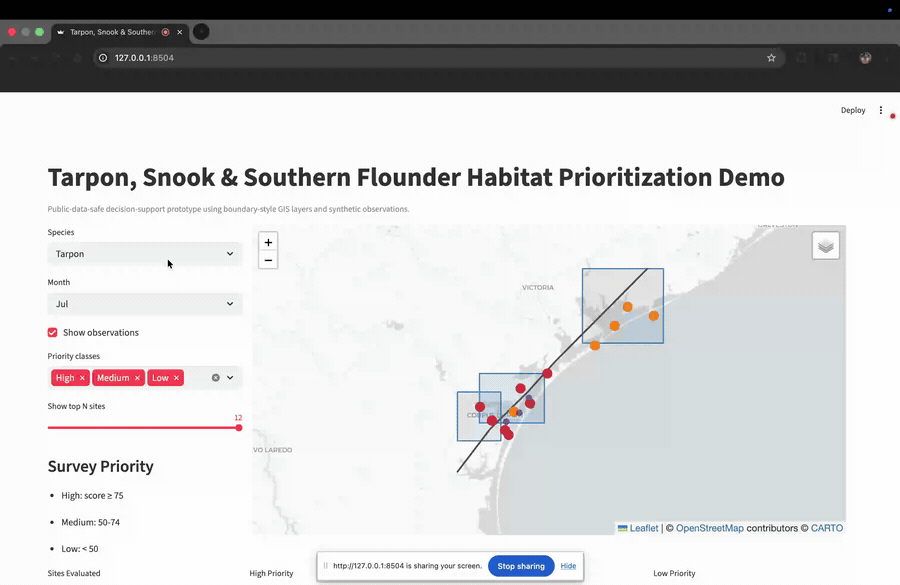
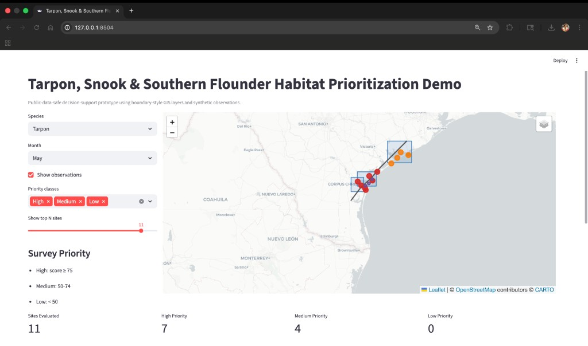
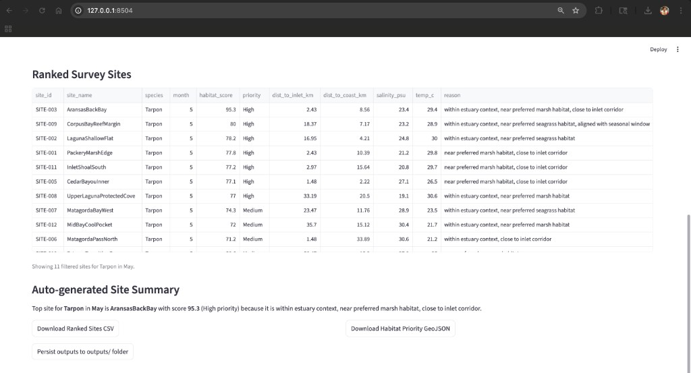
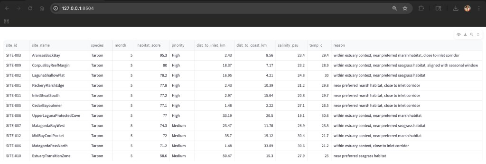
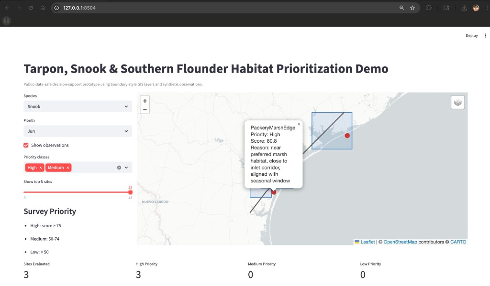
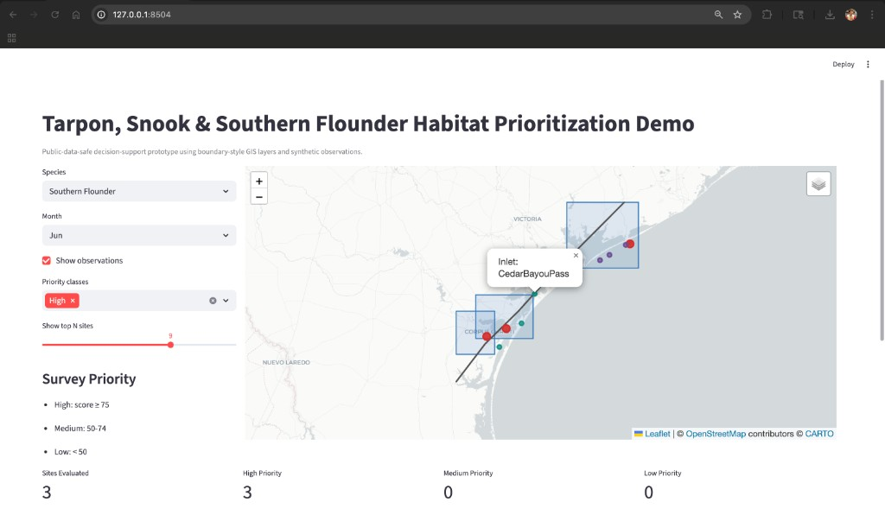

# tarpon-snook-flounder-habitat-explorer

Geospatial habitat prioritization demo — species filters, environmental covariates, survey ranking.

This prototype is a public-data-safe geospatial workflow focused on juvenile tarpon, snook, and Southern flounder habitat exploration. It demonstrates how Python, GIS layers, environmental covariates, and simple scoring logic can support survey planning, habitat exploration, and reproducible research outputs.

## What this demo does

- Loads boundary-style coastline, estuary, and inlet layers.
- Combines synthetic site/observation records with environmental covariates.
- Computes a transparent 0-100 habitat score for each candidate survey site.
- Labels sites as High/Medium/Low survey priority.
- Provides species and month filtering, map view, ranked table, and export buttons.

## Important limitation

This is **decision-support scaffolding**, not a validated ecological prediction model. It does not claim to predict true fish occurrence.

## Project structure

```text
tarpon-snook-flounder-habitat-explorer/
├── app.py
├── data/
│   ├── raw/
│   ├── processed/
│   └── synthetic/
├── notebooks/
├── src/
│   ├── data_loader.py
│   ├── habitat_score.py
│   ├── geospatial_utils.py
│   └── export_utils.py
├── outputs/
│   ├── maps/
│   ├── ranked_sites.csv
│   └── habitat_priority.geojson
├── README.md
└── requirements.txt
```

## Scoring logic (V1)

Each site receives a 0-100 score using weighted rule-based components:

- Habitat context (estuary + species-preferred shoreline habitat): **35%**
- Environmental suitability (salinity, temperature, DO, depth): **35%**
- Inlet relevance (distance to inlet, species-aware): **20%**
- Seasonal alignment (month and site season window): **10%**

Priority bins:

- High: `>= 75`
- Medium: `50-74`
- Low: `< 50`

## Run locally

1. Get the code and enter the project folder (use any directory you prefer):

   ```bash
   git clone https://github.com/ranjithguggilla/tarpon-snook-flounder-habitat-explorer.git
   cd tarpon-snook-flounder-habitat-explorer
   ```

   If you already downloaded or cloned it elsewhere, run `cd` to that folder instead—paths differ on every machine.

2. Create and activate a virtual environment (recommended), then install dependencies:

   ```bash
   python3 -m pip install -r requirements.txt
   ```

3. Start the app:

   ```bash
   streamlit run app.py
   ```

4. Open the shown local URL (typically `http://localhost:8501`).

You can also use `make` commands:

```bash
make setup
make run
```

### Quick troubleshooting

- If you see `requirements.txt` or `app.py` not found, run `pwd` and confirm you are inside the `tarpon-snook-flounder-habitat-explorer` project root (the folder that contains `app.py`).
- If the folder path has spaces, quote it in `cd`, e.g. `cd "/path/with spaces/project"`.
- If `streamlit` is not found, run `python3 -m pip install -r requirements.txt` again inside the project folder.

## Quality checks

- Local smoke test:

  ```bash
  make smoke
  ```

- GitHub Actions runs `scripts/smoke_test.py` automatically on push/PR to `main`.

## Data provenance

- `data/raw/*.geojson` are boundary-style demo layers.
- `data/synthetic/*.csv` are synthetic observations and survey sites.
- No private telemetry data, confidential field stations, or institute-restricted datasets are included.

See `data/raw/sources.md` for notes and replacement guidance.

## Outputs

You can export filtered ranking results directly from the UI as:

- CSV (`ranked_sites.csv`)
- GeoJSON (`habitat_priority.geojson`)

You can also persist files into `outputs/` via the in-app button.

## Demo media

- Walkthrough GIF: `assets/gifs/demo-overview.gif`



### Dashboard screenshots

| View | Preview |
|------|---------|
| Tarpon (May) overview map |  |
| Ranked sites table + summary/export actions |  |
| Ranked table detail view |  |
| Snook filter with site popup |  |
| Southern flounder filtered map |  |

## Why this is useful

- Supports transparent, reproducible survey planning discussions.
- Makes spatial and seasonal assumptions explicit and auditable.
- Provides lightweight exports for handoff into downstream GIS/statistical workflows.
